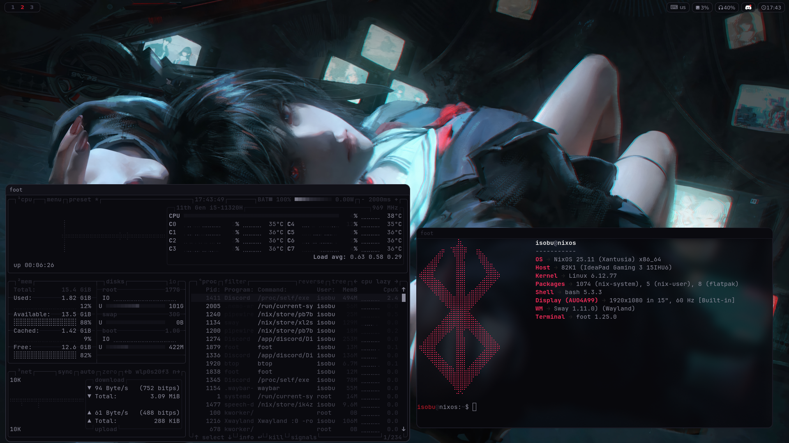

# minimal-dark-red-rice-for-NixOS
# 🔴 dark rice — NixOS + Sway

> minimal dark red rice for NixOS · Sway WM · foot terminal · custom colorscheme


---

## 📸 Screenshots

<p align="center">
  
</p>

---

## 🖥️ Setup

| Component     | Program                     |
|---------------|-----------------------------|
| OS            | NixOS                       |
| WM            | Sway                        |
| Bar           | Waybar                      |
| Terminal      | Foot                        |
| Launcher      | Wofi                        |
| Fetch         | Fastfetch                   |
| Editor        | Neovim (lazy.nvim)          |
| Font          | JetBrainsMono Nerd Font     |
| Monitor       | Btop (dark-r theme)         |
| Wallpaper     | Swaybg                      |
| Screenshots   | Grim                        |
| Media         | Playerctl / MPRIS           |
| Audio         | PulseAudio / Pavucontrol    |

---

## 🎨 Colors

| Role       | Hex       | Usage                                   |
|------------|-----------|-----------------------------------------|
| Background | `#0a0a0f` | foot, waybar, wofi, nvim, btop          |
| Surface    | `#111118` | nvim bg2, btop meters                   |
| Border     | `#1a1a24` | nvim WinSeparator, btop div_line        |
| Accent     | `#2a2a35` | nvim Visual, waybar module border       |
| Red        | `#cc1a2a` | focused elements, keywords, lualine     |
| Text       | `#8a8a9a` | foreground across all apps              |
| Dim        | `#333340` | line numbers, inactive elements         |

> Terminal opacity: **0.80** · waybar module backdrop: **0.60**

---

## 🚀 Installation

** IMPORTANT: Please be warned that it may not work perfectly out of the box. For best security, read over all the files to confirm there are no conflictions with your current system.

### 1. Clone the repo

```bash
git clone https://github.com/isobuYT/minimal-dark-red-rice-for-NixOS ~/dotfiles
cd ~/dotfiles
```

### 2. Create config directories

```bash
sudo mkdir -p /etc/nixos/modules
mkdir -p ~/.config/sway
mkdir -p ~/.config/waybar
mkdir -p ~/.config/foot
mkdir -p ~/.config/wofi
mkdir -p ~/.config/fastfetch
mkdir -p ~/.config/btop/themes
mkdir -p ~/.config/mako
mkdir -p ~/.config/cava
mkdir -p ~/.config/nvim/lua/plugins
```

### 3. Copy configs

```bash
sudo cp ~/dotfiles/etc/nixos/configuration.nix             /etc/nixos/configuration.nix
```

```bash
sudo cp ~/dotfiles/etc/nixos/modules/audio.nix             /etc/nixos/modules/audio.nix
sudo cp ~/dotfiles/etc/nixos/modules/boot.nix              /etc/nixos/modules/boot.nix  
sudo cp ~/dotfiles/etc/nixos/modules/fonts.nix             /etc/nixos/modules/fonts.nix  
sudo cp ~/dotfiles/etc/nixos/modules/nvidia.nix            /etc/nixos/modules/nvidia.nix
sudo cp ~/dotfiles/etc/nixos/modules/packages.nix          /etc/nixos/modules/packages.nix
sudo cp ~/dotfiles/etc/nixos/modules/programs.nix          /etc/nixos/modules/programs.nix
sudo cp ~/dotfiles/etc/nixos/modules/users.nix             /etc/nixos/modules/users.nix
```
```bash
cp ~/dotfiles/.config/sway/config                          ~/.config/sway/config
cp ~/dotfiles/.config/waybar/config                        ~/.config/waybar/config
cp ~/dotfiles/.config/waybar/style.css                     ~/.config/waybar/style.css
cp ~/dotfiles/.config/foot/foot.ini                        ~/.config/foot/foot.ini
cp ~/dotfiles/.config/wofi/config                          ~/.config/wofi/config
cp ~/dotfiles/.config/wofi/style.css                       ~/.config/wofi/style.css
cp ~/dotfiles/.config/fastfetch/config.jsonc               ~/.config/fastfetch/config.jsonc
cp ~/dotfiles/.config/fastfetch/logo.txt                   ~/.config/fastfetch/logo.txt
cp ~/dotfiles/.config/btop/btop.conf                       ~/.config/btop/btop.conf
cp ~/dotfiles/.config/btop/themes/dark-r.theme             ~/.config/btop/themes/dark-r.theme
cp ~/dotfiles/.config/nvim/init.lua                        ~/.config/nvim/init.lua
cp ~/dotfiles/.config/nvim/lazy-lock.json                  ~/.config/nvim/lazy-lock.json
cp ~/dotfiles/.config/nvim/lua/plugins/dankcolors.lua      ~/.config/nvim/lua/plugins/dankcolors.lua
```

### 4. Set the wallpaper

In `~/.config/sway/config`, update the wallpaper line:

```
output * bg ~/dotfiles/wallpapers/001.jpg fill
```

### 5. Set Waybar network interface

Find your interface, then edit `~/.config/waybar/config`:

```bash
ip link show
```

```json
"network": {
  "interface": "your-interface-name"
}
```

### 6. Rebuild NixOS

```bash
# standard
sudo nixos-rebuild switch

# with flakes
sudo nixos-rebuild switch --flake .#yourhost
```

### 7. Launch Sway

```bash
sway
```

> Add `exec sway` to `~/.bash_profile` (guarded by `[ -z "$DISPLAY" ] && [ "$(tty)" = "/dev/tty1" ]`) for auto-launch on TTY1.

---

## ⌨️ Keybinds

| Key                      | Action                    |
|--------------------------|---------------------------|
| `Super + Enter`          | Open Foot                 |
| `Super + A`              | Open Wofi launcher        |
| `Super + Q`              | Close focused window      |
| `Super + 1–5`            | Switch workspace          |
| `Super + Shift + 1–5`    | Move window to workspace  |
| `Super + F`              | Toggle fullscreen         |
| `Super + Shift + Space`  | Toggle floating           |
| `Super + Shift + E`      | Exit Sway                 |
| `Super + Shift + C`      | Reload Sway config        |
| `Print`                  | Screenshot (grim)         |


---

## 🖥️ Btop — dark-r theme

`btop/themes/dark-r.theme` maps the full palette:

| Key | Color | Meaning |
|-----|-------|---------|
| `main_bg` | `#0a0a0f` | background |
| `main_fg` | `#8a8a9a` | text |
| `temp_end` | `#cc1a2a` | critical temperature |
| `div_line` | `#1a1a24` | box borders |
| `selected_bg` | `#111118` | selection surface |

---

## ✨ Fastfetch — custom logo

The braille-art logo in `fastfetch/logo.txt` is loaded via `config.jsonc`:

```jsonc
{
  "logo": {
    "type": "file",
    "source": "~/.config/fastfetch/logo.txt",
    "color": { "1": "red", "2": "white" },
    "width": 5,
    "height": 5
  },
  "display": {
    "color": { "keys": "red", "title": "white", "separator": "black" },
    "separator": " → "
  }
}
```

Modules shown: `os · host · kernel · uptime · packages · shell · display · wm · terminal · cpu · gpu · memory · disk · localip`

---

## 📁 Structure

```
dotfiles/
├── etc
│   └── nixos
│       └── modules/
│           ├── audio.nix
│           ├── boot.nix
│           ├── fonts.nix
│           ├── nvidia.nix
│           ├── packages.nix
│           ├── programs.nix
│           └── users.nix
│ 
├── .config/
│   ├── btop/
│   │    ├── themes/
│   │    │   └── dark-r.theme
│   │    └── btop.conf  
│   ├── fastfetch/
│   │   ├── config.jsonc
│   │   └── logo.txt
│   ├── foot/
│   │   └── foot.ini
│   ├── nvim/
│   │   ├── init.lua
│   │   ├── lazy-lock.json
│   │   └── lua/
│   │       └── plugins/
│   │           └── dankcolors.lua
│   ├── sway/
│   │   └── config
│   ├── waybar/
│   │   ├── config
│   │   └── style.css
│   ├── wofi/
│   │   ├── config
│   │   └── style.css
│   └── .bashrc
│ 
├── screenshots/
│   └── 001.png
└── wallpapers/
    ├── 001.jpg
    └── 002.jpg
```
made with love on nixos!
